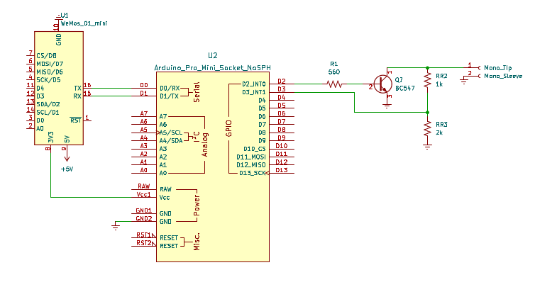

sony_slink
==========

This Arduino sketch is entirely based on the great work from [robho](https://github.com/robho/sony_slink). The only change is that the modified to allows the option of communicating over serial using raw Hex bytes. This is achieved by defining the 'HexOutput' option at the beginning of the code (if this is not defined the code behaves as the original code). 

I'm using this to control and read information from a Sony CDP-CX225 CD Player, and interfacing this with ESPHome using a ESP8266.

To physically connect the Arduino to the Sony via the S-Link bus and to the ESP8266 running ESPHome you need some additional components, below is the schematic.

Use a 3.5 mm mono plug to connect the circuite to the S-Link/Control A1 port of the Sony device.

The S-Link_CDP-CX225.ods file in the 'Supported Commands' folder lists the commands I have found work with the CDP-CX225.

----

Reference documents:
* http://web.archive.org/web/20070720171202/http://www.reza.net/slink/text.txt
* http://web.archive.org/web/20070705130320/http://www.undeadscientist.com/slink/
* http://web.archive.org/web/20180831072659/http://boehmel.de/slink.htm
