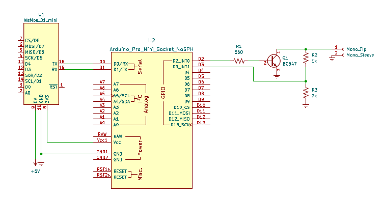

sony_slink
==========

This Arduino sketch is entirely based on the great work from [robho](https://github.com/robho/sony_slink). The only change is that the modified code allows the option of communicating over serial using raw Hex bytes. This is achieved by defining the 'HexOutput' option at the beginning of the code (if this is not defined the code behaves as the original code). 

I'm using this to control and read information from a Sony CDP-CX225 CD Player, and interfacing this with ESPHome using a ESP8266.

To physically connect the Arduino to the Sony via the S-Link bus and to the ESP8266 running ESPHome you need some additional components, below is the schematic.

The S-Link bus opeartes at a 5v logic level, while the ESP8266 operates at a 3.3v logic level. For Arduino boards there are options that operate either at 3.3v or 5v, therefore the circuit will depend on the type of Arduino board used. The schematics above uses an the 3.3v version of the Arduino Pro Mini, therefore the Arduino can be connected directly to the ESP8266 but R2 and R3 are needed. If an Arduino that operates at 5v logic level is used (e.g. Arduino Nano) then R2 and R3 are not needed but a logic level shifter is instead needed between the Arduino and the ESP8266.

A 3.5 mm mono plug shall be used to connect the circuit to the S-Link/Control A1 port of the Sony device.

The S-Link_CDP-CX225.ods file in the 'Supported Commands' folder lists the commands I have found work with the CDP-CX225.

----

Reference documents:
* http://web.archive.org/web/20070720171202/http://www.reza.net/slink/text.txt
* http://web.archive.org/web/20070705130320/http://www.undeadscientist.com/slink/
* http://web.archive.org/web/20180831072659/http://boehmel.de/slink.htm
